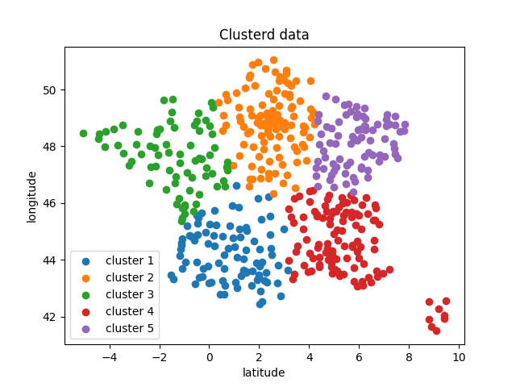

# K-means clustering
Shayane Katchera & Valentin Todisco\
A4 SET \
Ma422 Machine Leaning research project

## Explanation
----
This project is a research project for school on Unsupervised Learning.

## Result Example
with k = 5 :
